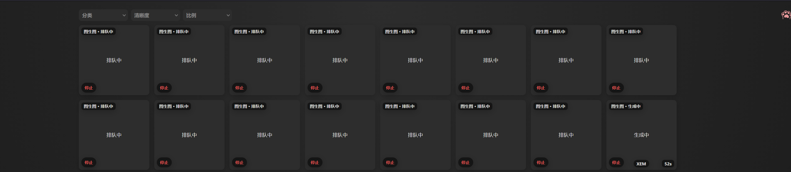

# GPT本地生图

一个本地图片生成网页工具，支持多站点、轮询、文生图、图生图、精修图和画廊管理。

## 功能

- 支持创建组图，一次生成多张图片，前提是你的 API 支持。
- 画廊支持框选删除。
- 图片太亮时，可以按 `Alt + ~` 把图片变暗。

## 使用

需要先安装 Node.js。

双击：

```text
start-tool.bat
```

或手动运行：

```bash
node server.js
```

然后打开：

```text
http://127.0.0.1:1024/
```

## 说明

- `start-tool.bat` 会自动启动本地服务并打开网页。
- `stop-tool.bat` 会关闭占用 `1024` 端口的进程。
- 项目可以放在任意盘符和文件夹中运行。

## 可能的问题

- 图片：默认，发送 { type: "image_generation" }
- 强制：发送 "required"
- 自动：发送 "auto"
- 如果某个站点报：Field 'tool_choice' must be a string
- 就把这个站点的 Resp工具 改成 强制，不行再试 自动。
- 轮询模式下也会用“被轮询到的那个站点”自己的 Resp工具 设置。

## 预览


